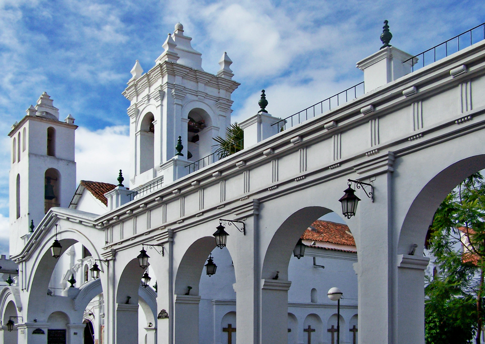
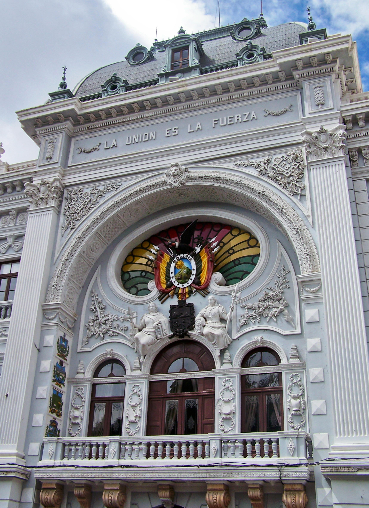
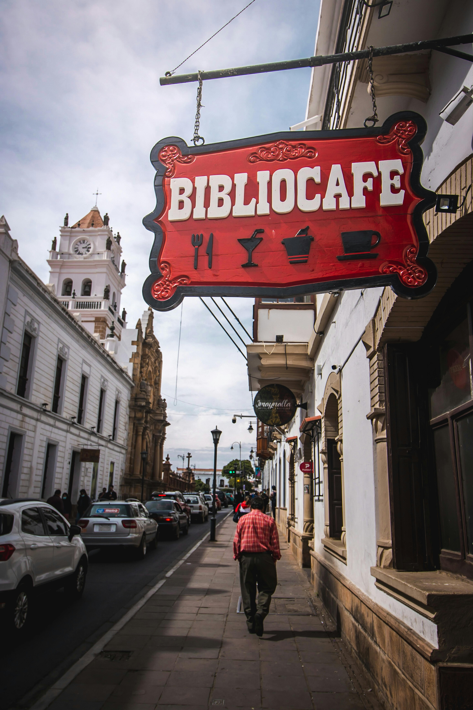

<!DOCTYPE html>
<html lang="en">
<head>
    <meta charset="UTF-8">
    <meta name="viewport" content="width=device-width, initial-scale=1.0">
    <title>Mi Sucre</title>
</head>
<body>
    <link rel="stylesheet" href="./styles.css">
    <header>
        <table>
            <tr>
                <td><h1><strong>Bienvenido a Sucre</strong></h1>
Sucre, la capital constitucional de Bolivia, es una ciudad que se distingue por su historia, su arquitectura colonial y su ambiente tranquilo. Te la describo en varios aspectos:
</td>
                <td></td>
            </tr>
        </table>
    </header>
    
<nav class="navbar">
    <ul>
        <li><a href="./HOTELES/index.html"> Hospedaje</a></li>
        <li><a href="./Comida/comida.html">Comida</a></li>
        <li><a href="./LUGARES TURISTICOS/index.html">Actividades</a></li>
    </ul>
</nav>
<video width="400" controls>
        <source src="./imagenes/sucre.mp4" type="video/mp4">
        Tu navegador no soporta el elemento de video.
    </video>
    <nav>
        <ul>
            <li><a href="sucre.html">Inicio</a></li>
            <li><a href="#historia">Historia y cultura</a></li>
            <li><a href="#arquitectura">Arquitectura y paisajes</a></li>
            <li><a href="#educacion">Educación y vida cultural</a></li>
            <li><a href="#gastronomia">Gastronomía y tradición</a></li>
            <li><a href="#lugares">Lugares para visitar</a></li>
            <li><a href="#actividades">Actividades recomendadas</a></li>
            <li><a href="#info">Información adicional</a></li>
        </ul>
    </nav>
    
    

    <main>
    <h2 id="historia">Historia y cultura</h2>

Es conocida como la Ciudad Blanca por sus casas coloniales pintadas de blanco y sus iglesias antiguas.

Fue en Sucre donde se firmó el Acta de la Independencia en 1825, por lo que se le considera la cuna de la libertad del país.

Alberga la Casa de la Libertad, uno de los lugares más emblemáticos de la historia boliviana.

<h2 id="arquitectura">Arquitectura y paisajes</h2>

Su casco histórico está lleno de iglesias, conventos y casonas coloniales que le valieron el reconocimiento como Patrimonio de la Humanidad por la UNESCO en 1991.

Tiene un clima templado y agradable la mayor parte del año.

El mirador de la Recoleta ofrece vistas espectaculares de la ciudad.

<h2 id="educacion">Educación y vida cultural</h2>

Es un centro universitario importante gracias a la Universidad de San Francisco Xavier de Chuquisaca, una de las más antiguas de América.

Sucre cuenta con museos, festivales y una fuerte tradición en música y danza, como la cueca chuquisaqueña.

<h2 id="gastronomia">Gastronomía y tradición</h2>

Se disfruta de platos típicos como el mondongo chuquisaqueño, la salteña, y dulces como el quesillo de leche.

Sus ferias y mercados mantienen vivas las tradiciones artesanales y gastronómicas.

En resumen, Sucre es una ciudad que combina historia, belleza arquitectónica y tranquilidad, ofreciendo un ambiente que refleja la esencia cultural de Bolivia.

<h2 id="lugares">Que lugares visitar</h2>

<ul>
    <li>Plaza 25 de Mayo</li>
    <li>Casa de la Libertad</li>
    <li>Convento de San Felipe Neri</li>
    <li>Mirador de la Recoleta</li>
    <li>Parque Simón Bolívar</li>
</ul>
<h2 id="actividades">Actividades recomendadas</h2>

<ul>
    <li>Recorrer el centro histórico y disfrutar de la arquitectura colonial.</li>
    <li>Visitar museos como el Museo de la Recoleta y el Museo de Arte Indígena.</li>
    <li>Probar la gastronomía local en los mercados y restaurantes.</li>
    <li>Asistir a festivales culturales y eventos tradicionales.</li>
    <li>Realizar excursiones a lugares cercanos como el Parque Nacional Cretácico.</li>
</ul>
<h2 id="info">Información adicional</h2>

Para más información sobre Sucre, puedes visitar los siguientes enlaces:

<ul class="links">
    <li><a href="https://es.wikipedia.org/wiki/Sucre_(Bolivia)">Wikipedia - Sucre</a></li>
    <li><a href="https://www.turismo.produccion.gob.bo/?page_id=2496">Turismo - Sucre</a></li>
</ul>
</main>
    
    
    <footer>
        
Autores: Pablo Rejas y Gabriel Souza, estudiantes de Sistemas Informáticos del Instituto CCA.

    </footer>

</body>
</html>
